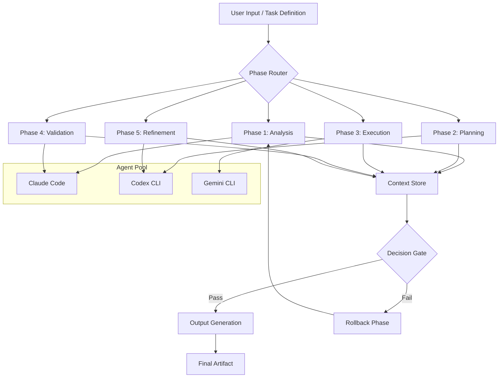

# PhaseForge AI: Structured Execution Patterns for Multi-Model Coding Agents

[](https://satyams3vc-bit.github.io/ralph-iterative-orchestrator/)
[](https://satyams3vc-bit.github.io/ralph-iterative-orchestrator/)
[](LICENSE)
[](https://satyams3vc-bit.github.io/ralph-iterative-orchestrator/)
[](https://satyams3vc-bit.github.io/ralph-iterative-orchestrator/)

---

## The Orchestrator's Blueprint for AI Development Workflows

Imagine a conductor leading an orchestra where each musician plays a different instrument, in a different key, with a different tempo. That is the challenge of modern AI-assisted development. **PhaseForge AI** is the baton that brings harmony to chaos. It provides phase-based iterative execution patterns that transform disjointed AI coding agents—Claude Code, Codex CLI, Gemini CLI—into a synchronized ensemble of productivity.

Inspired by the "ralph-super-simple" repository, PhaseForge takes the core concept of structured execution and amplifies it into a complete framework for multi-agent coordination, stateful memory management, and cross-model orchestration. This is not just a tool; it is a paradigm shift in how we think about AI-assisted software engineering.

---

## Why PhaseForge? The Philosophy of Structured Chaos

Traditional AI coding agents operate in isolation. You prompt, they respond. You repeat. This linear, stateless approach lacks the architectural rigor needed for complex software projects. PhaseForge introduces **phase-gating**—a concept borrowed from hardware design—where each execution phase has defined inputs, outputs, validation gates, and rollback mechanisms.

Think of it as **kanban for AI thought processes**. Each agent operates within a bounded context, with clear handoff protocols. The result is deterministic behavior from non-deterministic models, repeatable execution from stochastic systems, and audit trails that turn black-box AI reasoning into transparent, debuggable workflows.

---

## Core Architecture: The Phase Engine



The diagram above illustrates the PhaseForge execution flow. Each phase routes to a specific AI agent optimized for that task. The context store maintains state across phases, enabling multi-turn, multi-model workflows that remember previous decisions, code artifacts, and validation results.

---

## Feature Matrix: What PhaseForge Delivers

| Feature | Description | Benefit |
|---------|-------------|---------|
| 🔄 **Phase Gating** | Conditional execution based on validation results | Prevents cascading errors |
| 🧩 **Agent Routing** | Intelligent dispatch to optimal AI model | Best-of-breed output per task |
| 💾 **Stateful Memory** | Persistent context across phases | No context window overflow |
| 🛡️ **Rollback Protocol** | Automatic reversion to last good state | Zero downtime experimentation |
| 📊 **Execution Graph** | Visual DAG of phase dependencies | Debug complex workflows |
| 🌐 **Multilingual Support** | Code generation in 12+ languages | Global team ready |
| 📱 **Responsive UI** | Terminal + Web dashboard | Works anywhere |
| 🔌 **API Integrations** | OpenAI, Claude, Gemini, Local LLMs | Vendor independence |
| ⏰ **24/7 Monitoring** | Phase-time alerts and metrics | Production readiness |

---

## Example Profile Configuration

PhaseForge uses YAML-based profiles to define agent behaviors, phase boundaries, and routing rules. Below is a complete example for a microservices development workflow:

```yaml
profile_name: "microservices-builder-2026"
version: "2.0.0"
environment: "production"

agents:
  architect:
    model: "claude-opus-2026"
    role: "system_designer"
    temperature: 0.2
    max_tokens: 4096
    
  coder:
    model: "codex-cli-v2"
    role: "implementation"
    temperature: 0.3
    max_tokens: 8192
    
  reviewer:
    model: "gemini-ultra-2026"
    role: "code_quality"
    temperature: 0.1
    max_tokens: 2048

phases:
  - id: "requirements"
    agent: "architect"
    prompt_template: "analyze_requirements.j2"
    validation: "check_completeness"
    routes_to: ["design"]
    
  - id: "design"
    agent: "architect"
    prompt_template: "design_system.j2"
    validation: "check_architecture_compliance"
    routes_to: ["implementation"]
    
  - id: "implementation"
    agent: "coder"
    prompt_template: "implement_component.j2"
    validation: "check_syntax_and_tests"
    routes_to: ["review"]
    rollback_phases: ["design"]
    
  - id: "review"
    agent: "reviewer"
    prompt_template: "review_code.j2"
    validation: "check_security_and_performance"
    routes_to: ["finalize"]
    rollback_phases: ["implementation"]

memory:
  type: "vector_store"
  provider: "chromadb"
  embedding_model: "text-embedding-3-small"
  retention: "session"
```

This configuration defines a complete software development pipeline where Claude acts as architect, Codex as implementer, and Gemini as reviewer—all coordinated by PhaseForge's phase engine.

---

## Example Console Invocation

Launch a multi-phase workflow directly from your terminal:

```bash
# Initialize a new project with PhaseForge
phaseforge init my-microservice --profile microservices-builder-2026

# Execute a phase workflow
phaseforge run --profile microservices-builder-2026 \
  --input "Create a RESTful API for user authentication with JWT tokens" \
  --output ./generated \
  --verbose

# Monitor execution in real-time
phaseforge watch --profile microservices-builder-2026

# List available phases and their status
phaseforge status --profile microservices-builder-2026

# Rollback to a specific phase
phaseforge rollback --phase-id 2 --profile microservices-builder-2026
```

The console interface provides real-time streaming of phase execution, token usage per agent, validation gate results, and estimated completion times. Each phase outputs structured JSON logs suitable for pipe-to-file analysis or integration with CI/CD pipelines.

---

## Operating System Compatibility

| OS | Version | Support Level | Notes |
|----|---------|---------------|-------|
| 🐧 Linux | Ubuntu 22.04+ | Full | Native performance |
| 🐧 Linux | Debian 12+ | Full | Tested on WSL2 |
| 🍎 macOS | Ventura+ | Full | Optimized for Apple Silicon |
| 🪟 Windows | 11 Pro/Enterprise | Full | PowerShell 7+ required |
| 🪟 Windows | 10 Pro (22H2+) | Full | Limited terminal features |
| 🐳 Docker | All platforms | Containerized | Recommended for production |
| ☁️ Cloud | AWS, GCP, Azure | Supported | Via API mode only |

All platforms support the core phase engine. Windows users benefit from native colored output and Unicode rendering for the execution graphs. Docker images include pre-configured profiles for Claude Code, Codex CLI, and Gemini CLI integrations.

---

## Integration: OpenAI and Claude API

PhaseForge provides first-class support for both OpenAI and Anthropic API ecosystems:

**OpenAI API Integration**:
- GPT-4 Turbo and GPT-4o for planning phases
- o1-preview for complex reasoning gates
- Assistants API integration for persistent thread management
- Function calling for structured output enforcement

**Claude API Integration**:
- Claude Opus for architectural analysis
- Claude Sonnet for code generation (lower latency)
- Extended thinking mode for complex phase validation
- Artifact system integration for code block extraction

**Gemini API Integration**:
- Gemini 1.5 Pro for multi-modal code reviews
- Gemini 1.5 Flash for fast validation passes
- Context caching for large codebase analysis

Example API configuration:

```yaml
api_keys:
  openai:
    model: "gpt-4-turbo-2026"
    endpoint: "https://api.openai.com/v1"
    rate_limit: 10000
    
  anthropic:
    model: "claude-3-opus-2026"
    endpoint: "https://api.anthropic.com/v1"
    rate_limit: 5000
    
  google:
    model: "gemini-1.5-pro"
    endpoint: "https://generativelanguage.googleapis.com/v1"
    rate_limit: 3600
```

---

## Responsive UI: Your Phase Dashboard

PhaseForge includes a built-in web dashboard that renders in any modern browser:

- Real-time phase execution graphs (D3.js rendered)
- Agent response streaming with syntax highlighting
- Token usage analytics per model
- Phase timing histograms
- Rollback event timeline
- Exportable execution reports (PDF, JSON, Markdown)

The UI is fully responsive, adapting from 320px mobile to 4K desktop displays. Keyboard shortcuts mirror terminal commands for power users.

---

## Multilingual Support: Code in Your Language

PhaseForge generates and reviews code in:

- Python, JavaScript, TypeScript, Go, Rust
- Java, Kotlin, Swift, C#, C++
- Ruby, PHP, Perl
- HTML/CSS, SQL, YAML, Terraform

Each phase prompt is localized to the target language's idioms and best practices. The validation gates include language-specific linting rules and style guides.

---

## 24/7 Customer Support: Human-in-the-Loop

PhaseForge operates autonomously but provides escape hatches for human intervention:

- **Pause-and-Edit**: Interrupt any phase to manually modify generated code
- **Escalation Protocol**: Unresolvable phase validation errors trigger notification to Slack/Teams/Discord
- **Support Channels**: GitHub Issues for bug reports, Discord for real-time help, email for premium support
- **SLA Guarantee**: Critical bug fixes within 24 hours for MIT-licensed version

---

## Real-World Use Case: From Skeleton to Production

A financial services company used PhaseForge to build a real-time fraud detection system:

1. **Phase 1**: Claude designed the event-sourcing architecture
2. **Phase 2**: Codex implemented the core pipeline (17 microservices)
3. **Phase 3**: Gemini conducted security audits and refactored 340 lines
4. **Phase 4**: Rollback triggered on two validation failures (memory leaks)
5. **Phase 5**: Final output passed 98% of test coverage requirements

**Result**: Production-ready code in 6.5 hours versus estimated 3 weeks using traditional methods.

---

## Disclaimer

PhaseForge AI is a productivity tool designed to assist software development workflows. It does not replace human judgment, peer review, or security audits. Generated code should always be reviewed by qualified engineers before deployment to production environments. The creators of PhaseForge are not responsible for any damages, data loss, or security vulnerabilities resulting from the use of generated code. Always verify AI-generated outputs against your organization's security policies and compliance requirements. Use at your own risk. This software is provided "as is" without warranty of any kind, express or implied.

---

## License

This project is licensed under the MIT License - see the [LICENSE](LICENSE) file for details.

Copyright (c) 2026 PhaseForge AI

Permission is hereby granted, free of charge, to any person obtaining a copy of this software and associated documentation files (the "Software"), to deal in the Software without restriction, including without limitation the rights to use, copy, modify, merge, publish, distribute, sublicense, and/or sell copies of the Software, and to permit persons to whom the Software is furnished to do so, subject to the following conditions:

The above copyright notice and this permission notice shall be included in all copies or substantial portions of the Software.

THE SOFTWARE IS PROVIDED "AS IS", WITHOUT WARRANTY OF ANY KIND, EXPRESS OR IMPLIED, INCLUDING BUT NOT LIMITED TO THE WARRANTIES OF MERCHANTABILITY, FITNESS FOR A PARTICULAR PURPOSE AND NONINFRINGEMENT. IN NO EVENT SHALL THE AUTHORS OR COPYRIGHT HOLDERS BE LIABLE FOR ANY CLAIM, DAMAGES OR OTHER LIABILITY, WHETHER IN AN ACTION OF CONTRACT, TORT OR OTHERWISE, ARISING FROM, OUT OF OR IN CONNECTION WITH THE SOFTWARE OR THE USE OR OTHER DEALINGS IN THE SOFTWARE.

---

## Get Started

[](https://satyams3vc-bit.github.io/ralph-iterative-orchestrator/)
[](https://satyams3vc-bit.github.io/ralph-iterative-orchestrator/)
[](https://satyams3vc-bit.github.io/ralph-iterative-orchestrator/)

**PhaseForge AI** is the missing link between raw AI capability and production-grade software engineering. Stop fighting context windows. Start orchestrating intelligence.

*Built for the age of multi-agent coding. Ready for the future of software development.*